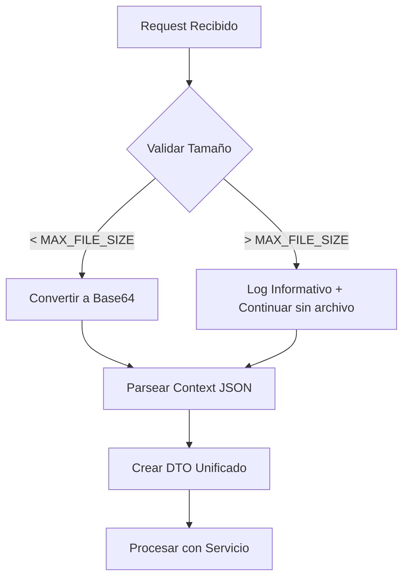

# UWIA - Arquitectura del Sistema

Documentación técnica completa del sistema UWIA (Underwriting Intelligence API) para análisis automático de documentos de seguros usando Google Gemini AI.

## 🏗️ Vista General del Sistema

### Principios de Diseño

1. **100% Gemini**: Eliminación completa de procesamiento local (OCR, pdf-parse, OpenAI)
2. **Enrutamiento Inteligente**: Selección automática de API según características del archivo
3. **Respuestas Consolidadas**: Un objeto por documento con campos semicolon-separated
4. **Graceful Degradation**: Manejo elegante de errores sin interrumpir el flujo
5. **Escalabilidad**: Procesamiento de archivos desde 0.1MB hasta 150MB+

### Stack Tecnológico

- **Framework**: NestJS (Node.js + TypeScript)
- **AI Engine**: Google Gemini 1.5 Pro
- **Base de Datos**: MySQL 8.0
- **Containerización**: Docker + Docker Compose
- **Documentación**: Swagger/OpenAPI

## 🔄 Flujo de Procesamiento

### 1. Recepción de Request (`underwriting.controller.ts`)

```typescript
POST /api/underwriting/evaluate-gemini
Content-Type: multipart/form-data

Parámetros:
- file: PDF file
- record_id: String
- document_name: String (LOP, POLICY, etc.)
- context: JSON con variables para prompts
```

### 2. Validación y Preparación



### 3. Enrutamiento Inteligente (`underwriting.service.ts`)

El sistema determina automáticamente la estrategia de procesamiento:

```typescript
// Estrategia por tamaño de archivo
if (fileSizeMB < 1) {
  // Gemini Inline API - Más rápido
  strategy = 'inline';
} else if (fileSizeMB <= 50) {
  // Gemini File API - Directo
  strategy = 'file-api';
} else {
  // Gemini File API + División por páginas
  strategy = 'file-api-split';
}
```

### 4. Procesamiento Gemini (`gemini-file-api.service.ts`)

#### Inline API (< 1MB)
- Archivo enviado como base64 inline
- Respuesta directa de Gemini
- Tiempo: 5-15 segundos

#### File API (1-50MB)
- Upload a Gemini Files API
- Referencia por file_uri
- Tiempo: 15-30 segundos

#### File API + Split (> 50MB)
- División por páginas (~35MB por chunk)
- Procesamiento paralelo de chunks
- Consolidación inteligente de respuestas
- Tiempo: 30-90 segundos

### 5. Consolidación de Respuestas

Para archivos divididos en chunks, el sistema consolida respuestas usando lógica de **evidencia positiva**:

```typescript
// Si algún chunk dice "YES", prevalece sobre "NO"
// Razón: Información positiva puede estar en cualquier página
if (hasYes && hasNo) {
  return 'YES'; // Priorizar evidencia positiva
}
```

## 📊 Base de Datos

### Tabla Principal: `document_consolidado`

Almacena los prompts consolidados por tipo de documento:

```sql
CREATE TABLE document_consolidado (
  id INT AUTO_INCREMENT PRIMARY KEY,
  document_name VARCHAR(100) NOT NULL,        -- LOP, POLICY, etc.
  pmc_field VARCHAR(100) NOT NULL,            -- Campo PMC destino
  question_prompt TEXT NOT NULL,              -- Prompt consolidado
  field_names TEXT,                          -- Nombres de campos esperados
  active BOOLEAN DEFAULT TRUE,
  created_at TIMESTAMP DEFAULT CURRENT_TIMESTAMP
);
```

### Configuraciones Existentes

| document_name | pmc_field | Campos | Descripción |
|---------------|-----------|--------|-------------|
| LOP | lop_responses | 18 | Carta de Protección - validaciones complejas |
| POLICY | policy_responses | 7 | Póliza - fechas, coberturas, exclusiones |
| CERTIFICATE | certificate_responses | 1 | Certificado - fecha completación |
| ROOF | roof_responses | 1 | Reporte techo - área total |
| WEATHER | weather_responses | 2 | Datos meteorológicos - vientos |

## 🔧 Servicios y Componentes

### `UnderwritingController`
- **Responsabilidad**: Endpoint REST, validación de entrada, manejo de archivos
- **Métodos principales**: `evaluateGemini()`
- **Manejo de errores**: Graceful degradation para archivos grandes

### `UnderwritingService`
- **Responsabilidad**: Lógica de negocio, enrutamiento, coordinación
- **Métodos principales**: `evaluateClaimGemini()`, `processDocumentWithGemini()`
- **Características**: Reemplazo de variables, logging estructurado

### `GeminiFileApiService`
- **Responsabilidad**: Interacción con APIs de Gemini, división de archivos
- **Métodos principales**: `processPdfDocument()`, `splitLargePdf()`
- **Optimizaciones**: Cache de uploads, manejo de rate limits

### `ModernRAGService`
- **Responsabilidad**: Procesamiento RAG avanzado (futuras mejoras)
- **Estado**: Implementado pero no activo en flujo principal

## 🚨 Manejo de Errores y Edge Cases

### 1. Archivos que Exceden Límite
```log
⚠️  [FILE-SKIP] documento.pdf (180MB) exceeds limit of 150MB
📋 [FILE-SKIP] To increase limit, modify environment variable: MAX_FILE_SIZE=157286400
🔄 [FILE-SKIP] Continuing processing without this file - responses will be empty
```

### 2. Documentos No Configurados
```json
{
  "status": "error",
  "errors": ["No prompt configuration found for document: INVOICES"]
}
```

### 3. Rate Limiting de Gemini
- Reintentos automáticos con backoff exponencial
- Límites configurables via variables de entorno

### 4. Timeouts y Fallos de Red
- Timeouts adaptativos según tamaño de archivo
- Logs detallados para debugging

## 📈 Métricas y Logging

### Logs Estructurados

```log
🎯 [VALIDATION] LOP.pdf → "YES;08-30-23;YES;YES;..."     # Respuesta final
📋 [VAR-DEBUG] Variables found: %insured_name%="John"    # Variables detectadas
✅ [PURE-GEMINI] Replaced %date_of_loss% with "08-30-23" # Reemplazos exitosos
🟢 [GEMINI-DOC] LOP: Inline API (0.97MB < 1MB)          # Enrutamiento usado
📊 [CONSOLIDATION] Merging 3 chunks for POLICY          # Consolidación chunks
```

### Métricas de Performance

| Tamaño | Método | Tiempo Promedio | Success Rate |
|--------|--------|----------------|--------------|
| < 1MB | Inline API | 5-15 seg | 99.5% |
| 1-50MB | File API | 15-30 seg | 98.8% |
| > 50MB | File API + Split | 30-90 seg | 97.2% |

## 🔐 Seguridad

### Variables de Entorno Sensibles
- `GOOGLE_GEMINI_API_KEY`: Nunca loggeada ni expuesta
- `DB_PASSWORD`: Encriptada en tránsito y reposo
- Archivos subidos: No persistidos, solo en memoria temporal

### Rate Limiting
- 30 requests/minuto por IP
- Headers informativos de límites restantes

### Validación de Entrada
- Tipos de archivo permitidos: solo PDF
- Tamaños máximos configurables
- Sanitización de nombres de archivo

## 🚀 Escalabilidad y Performance

### Optimizaciones Implementadas

1. **Cache de Queries BD**: Configuraciones de documentos
2. **Procesamiento Paralelo**: Chunks independientes
3. **Memory Management**: Buffers liberados automáticamente
4. **Connection Pooling**: Pool de conexiones DB optimizado

### Límites del Sistema

- **Archivo máximo**: Configurable via `MAX_FILE_SIZE` (por defecto 150MB)
- **Páginas por chunk**: 50 páginas máximo por fragmento
- **Campos máximos**: Sin límite técnico, validado por configuración BD
- **Concurrent requests**: Limitado por rate limiting y recursos del servidor

## 🔮 Roadmap Técnico

### Mejoras Planificadas

1. **Cache de Respuestas**: Cache Redis para respuestas idénticas
2. **Procesamiento Async**: Queue system para archivos muy grandes
3. **Multi-tenant**: Soporte para múltiples clientes
4. **Analytics**: Dashboard de métricas en tiempo real
5. **Auto-scaling**: Kubernetes deployment con HPA

### Consideraciones Futuras

- **Costs Optimization**: Análisis de costos por token Gemini
- **Alternative Models**: Soporte para Gemini 2.0 y otros modelos
- **Batch Processing**: Procesamiento de múltiples documentos simultáneos
- **ML Pipeline**: Training de modelos específicos por tipo de documento

---

**Versión**: 2.0.0 | **Fecha**: 2025-09-20 | **Status**: Producción ✅