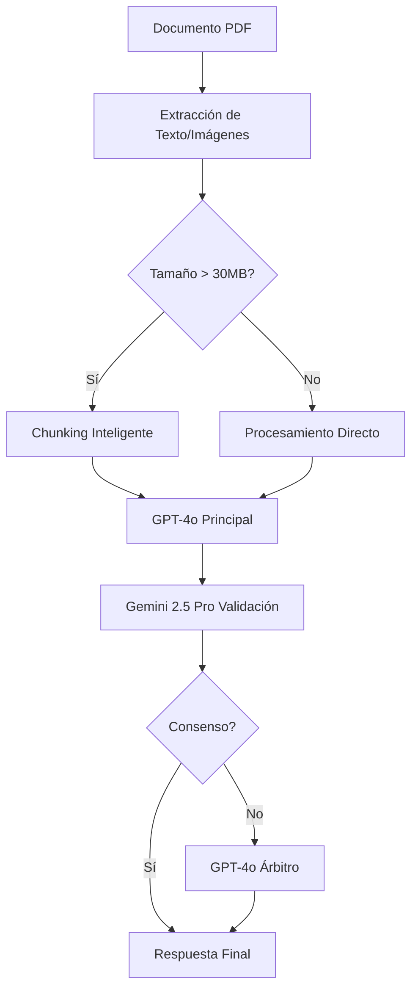

# UWIA - Sistema GPT-4o + Gemini 2.5 Pro

## 📋 Sistema Actual en Producción

**UWIA** es un sistema de underwriting inteligente que utiliza **dual validation** con:
- **GPT-4o** - Motor principal con chunking inteligente
- **Gemini 2.5 Pro** - Validación independiente (2M tokens contexto)

## 🚀 Configuración de Producción

### Variables de Entorno Principales

```bash
# ===== API Configuration =====
PORT=5035
NODE_ENV=production

# ===== Base de Datos =====
DB_HOST=automate_mysql
DB_PORT=3306
DB_USERNAME=mysql
DB_DATABASE=axioma
DOCUMENT_PROMPTS_TABLE_NAME=document_consolidado

# ===== OpenAI GPT-4o =====
OPENAI_API_KEY=sk-proj-...
OPENAI_MODEL=gpt-4o
OPENAI_ENABLED=true
OPENAI_TIMEOUT=600000
OPENAI_TEMPERATURE=0.1
OPENAI_MAX_TOKENS=8192

# ===== Gemini 2.5 Pro =====
GEMINI_API_KEY=AIzaSy...
GEMINI_ENABLED=true
GEMINI_MODEL=gemini-2.5-pro
GEMINI_TEMPERATURE=0.1
GEMINI_THINKING_MODE=true
GEMINI_RATE_LIMIT_RPM=80
GEMINI_RATE_LIMIT_TPM=1500000

# ===== Procesamiento =====
MAX_FILE_SIZE=104857600  # 100MB
LARGE_FILE_TIMEOUT=300000
LOCAL_PROCESSING_DEFAULT=false
MAX_PAGES_TO_CONVERT=10
```

## 📄 Tipos de Documentos Soportados

El sistema procesa 7 tipos de documentos con prompts consolidados:

| Documento | Campos | Función |
|-----------|--------|---------|
| **LOP.pdf** | 18 | Mechanics lien, firmas, direcciones, comparaciones |
| **POLICY.pdf** | 9 | Fechas de póliza, cobertura, exclusiones |
| **ESTIMATE.pdf** | 1 | Firma de aprobación de monto |
| **MOLD.pdf** | 1 | Condiciones de moho (Positive/Negative) |
| **WEATHER.pdf** | 2 | Velocidad viento y ráfagas |
| **CERTIFICATE.pdf** | 1 | Fecha de completación |
| **ROOF.pdf** | 1 | Área total del techo en pies² |

## 🔄 Flujo de Procesamiento



## 🛠 API Endpoints

### Health Check
```bash
GET /api/underwriting/health
```

### Procesar Documento Individual
```bash
POST /api/underwriting/evaluate-claim-multipart
Content-Type: multipart/form-data

- record_id: "175568"
- document_name: "LOP" | "POLICY" | "ESTIMATE" | "MOLD" | "WEATHER" | "CERTIFICATE" | "ROOF"
- context: JSON con datos de referencia
- file: PDF document
```

### Procesar Lote
```bash
POST /api/underwriting/evaluate-claim-batch
Content-Type: application/json

{
  "record_id": "175568",
  "documents": [
    {
      "document_name": "LOP",
      "file_data": "base64_encoded_pdf",
      "context": {...}
    }
  ]
}
```

## 📊 Respuesta del Sistema

```json
{
  "record_id": "175568",
  "status": "success",
  "results": {
    "LOP.pdf": [
      {
        "pmc_field": "mechanics_lien",
        "question": "...",
        "answer": "NO",
        "confidence": 0.8,
        "processing_time_ms": 57810,
        "error": null
      }
    ]
  },
  "summary": {
    "total_documents": 1,
    "processed_documents": 1,
    "total_fields": 18,
    "answered_fields": 18
  }
}
```

## 🔧 Rate Limiting

### GPT-4o Límites
- **RPM**: 30 requests/minuto
- **TPM**: 30,000 tokens/minuto
- **Timeout**: 90 segundos

### Gemini Límites
- **RPM**: 80 requests/minuto
- **TPM**: 1,500,000 tokens/minuto
- **Timeout**: 120 segundos

## 📁 Estructura de Archivos Grandes

Para archivos > 30MB:
- **Chunking inteligente** por páginas
- **Procesamiento paralelo** limitado
- **Timeouts escalados** hasta 10 minutos
- **Memoria optimizada** máx 512MB

## 🔍 Logging y Monitoreo

### Logs de Producción
```bash
# Nivel de logging
LOG_LEVEL=info

# Logs específicos
ENABLE_DOCUMENT_START_END_LOGS=true
ENABLE_FIELD_SUCCESS_LOGS=false
ENABLE_VISION_API_LOGS=false
```

### Métricas Clave
- **Tiempo de procesamiento** por documento
- **Rate de éxito** por tipo de documento  
- **Consenso dual validation** (GPT-4o vs Gemini)
- **Uso de tokens** por provider

## 🚨 Troubleshooting

### Errores Comunes

| Error | Causa | Solución |
|-------|-------|----------|
| `GEMINI_ERROR` | API key inválida | Verificar GEMINI_API_KEY |
| `TIMEOUT` | Archivo muy grande | Verificar LARGE_FILE_TIMEOUT |
| `RATE_LIMIT` | Demasiadas requests | Esperar o ajustar RPM |
| `NOT_FOUND` | Documento no configurado | Verificar document_consolidado |

### Comandos Útiles

```bash
# Ver logs en tiempo real
docker logs -f automate_uwia_qa

# Verificar salud
curl http://automate_uwia_qa:5035/api/underwriting/health

# Build y restart
npm run build && pm2 restart uwia
```

## 🎯 Performance

### Benchmarks Típicos
- **Documento pequeño** (< 1MB): 5-15 segundos
- **Documento mediano** (1-10MB): 15-45 segundos  
- **Documento grande** (10-100MB): 1-5 minutos
- **Ultra grande** (> 100MB): 5-10 minutos

### Optimizaciones Activas
- ✅ Dual validation con consenso
- ✅ Chunking inteligente 
- ✅ Rate limiting adaptativo
- ✅ Procesamiento paralelo
- ✅ Caché de imágenes
- ✅ Timeouts escalados

---

*Última actualización: Septiembre 2025*
*Sistema: GPT-4o + Gemini 2.5 Pro*