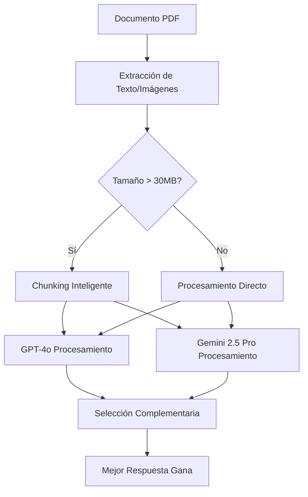

# UWIA - Sistema GPT-4o + Gemini 2.5 Pro

## 📋 Sistema Actual en Producción

**UWIA** es un sistema de underwriting inteligente con **validación complementaria**:
- **GPT-4o** - Motor principal con chunking inteligente
- **Gemini 2.5 Pro** - Procesamiento independiente (2M tokens contexto)
- **Sistema**: Ambos modelos trabajan juntos de forma complementaria, no competitiva

## 🚀 Configuración de Producción

### Variables de Entorno Principales (Actualizado: Diciembre 2024)

```bash
# ===== API Configuration =====
PORT=5035
NODE_ENV=production

# ===== Base de Datos =====
DB_HOST=automate_mysql
DB_PORT=3306
DB_USERNAME=mysql
DB_PASSWORD=[SECURED]
DB_DATABASE=axioma
DOCUMENT_PROMPTS_TABLE_NAME=document_consolidado

# ===== OpenAI GPT-4o =====
OPENAI_API_KEY=[SECURED - sk-proj-...]
OPENAI_MODEL=gpt-4o
OPENAI_ENABLED=true
OPENAI_TIMEOUT=90000  # 90 segundos
OPENAI_TEMPERATURE=0.1
OPENAI_MAX_TOKENS=8192
OPENAI_VALIDATION_MODEL=gpt-4o
# OPENAI_DUAL_VALIDATION - ELIMINADO (obsoleto)
OPENAI_MAX_TEXT_LENGTH=15000
OPENAI_USE_FOR_SIMPLE_PDFS_ONLY=true
OPENAI_FALLBACK_TO_LOCAL=true
OPENAI_VISION_TEMPERATURE=0.1

# ===== Gemini 2.5 Pro =====
GEMINI_API_KEY=[SECURED - AIzaSy...]
GEMINI_ENABLED=true
GEMINI_MODEL=gemini-2.5-pro
GEMINI_TEMPERATURE=0.1
GEMINI_MAX_TOKENS=8192
GEMINI_THINKING_MODE=true
GEMINI_RATE_LIMIT_RPM=80
GEMINI_RATE_LIMIT_TPM=1500000
GEMINI_TIMEOUT=120000
GEMINI_MAX_RETRIES=3
GEMINI_PERFORMANCE_LOGGING=true
GEMINI_SUCCESS_RATE_THRESHOLD=90
GEMINI_AUTO_FALLBACK=true

# ===== Procesamiento =====
MAX_FILE_SIZE=104857600  # 100MB
LARGE_FILE_TIMEOUT=300000  # 5 minutos
ULTRA_LARGE_PDF_TIMEOUT=600000  # 10 minutos
LOCAL_PROCESSING_DEFAULT=false
LOCAL_PROCESSING_FOR_COMPLEX_PDFS=true
MAX_PAGES_TO_CONVERT=10

# ===== Rate Limiting =====
OPENAI_RATE_LIMIT_RPM=30
OPENAI_RATE_LIMIT_TPM=30000
OPENAI_MAX_RETRIES=5
OPENAI_RETRY_DELAY=5000
```

## 📄 Tipos de Documentos Soportados

El sistema procesa 7 tipos de documentos con prompts de preguntas:

| Documento | Campos | Función |
|-----------|--------|---------|
| **LOP.pdf** | 18 | Mechanics lien, firmas, direcciones, comparaciones |
| **POLICY.pdf** | 7 | Fechas de póliza, cobertura, exclusiones |
| **ESTIMATE.pdf** | 1 | Firma de aprobación de monto |
| **MOLD.pdf** | 1 | Condiciones de moho (Positive/Negative) |
| **WEATHER.pdf** | 2 | Velocidad viento y ráfagas |
| **CERTIFICATE.pdf** | 1 | Fecha de completación |
| **ROOF.pdf** | 1 | Área total del techo en pies² |

**Total**: 31 campos unificados

## ✅ SISTEMA DE VALIDACIÓN COMPLEMENTARIA

### Configuración Actual:
- **GEMINI_ENABLED**: `true` ✅
- **COMPLEMENTARY_VALIDATION**: Activada automáticamente
- **RESULTADO**: GPT-4o + Gemini procesan cada documento de forma complementaria

### Funcionamiento del Sistema Complementario:
1. **GPT-4o** procesa el documento (análisis principal)
2. **Gemini 2.5 Pro** procesa independientemente (validación masiva con 2M tokens)
3. **Selección inteligente**:
   - Si uno encuentra datos y el otro no → El que encontró datos gana
   - Si ambos encuentran datos → El más confiable gana
   - Si ninguno encuentra datos → El más confiable en "no encontrado" gana
4. **Alta disponibilidad**: Si un servicio falla, el otro completa la tarea

### Ventajas vs Sistema Anterior:
- ✅ **No compiten** - se complementan
- ✅ **Alta disponibilidad** - failover automático  
- ✅ **Maximiza información** - prioriza quien encuentra datos
- ✅ **Sin arbitrajes** - decisión directa basada en utilidad

## 🔄 Flujo de Procesamiento



## 🛠 API Endpoints

### Health Check
```bash
GET /api/underwriting/health
```

### Procesar Documento Individual
```bash
POST /api/underwriting/evaluate-claim-multipart
Content-Type: multipart/form-data

- record_id: "175568"
- document_name: "LOP" | "POLICY" | "ESTIMATE" | "MOLD" | "WEATHER" | "CERTIFICATE" | "ROOF"
- context: JSON con datos de referencia
- file: PDF document
```

### Procesar Lote
```bash
POST /api/underwriting/evaluate-claim-batch
Content-Type: application/json

{
  "record_id": "175568",
  "documents": [
    {
      "document_name": "LOP",
      "file_data": "base64_encoded_pdf",
      "context": {...}
    }
  ]
}
```

## 📊 Respuesta del Sistema (Formato Consolidado)

**IMPORTANTE**: El sistema ahora devuelve **respuestas consolidadas** - un documento genera una sola respuesta con valores separados por semicolons.

### Ejemplo LOP.pdf (18 campos consolidados):
```json
{
  "record_id": "175568",
  "status": "success",
  "results": {
    "LOP.pdf": [
      {
        "pmc_field": "lop_responses",
        "question": "Analyze this document and extract the following information in order: determine if there is any language related to liens...",
        "answer": "NO;NOT_FOUND;YES;YES;NOT_FOUND;NOT_FOUND;NOT_FOUND;NOT_FOUND;NOT_FOUND;NOT_FOUND;NOT_FOUND;NO;NO;NO;NO;NO;NO;NO",
        "confidence": 1.0,
        "processing_time_ms": 104590,
        "error": null
      }
    ]
  },
  "summary": {
    "total_documents": 1,
    "processed_documents": 1,
    "total_fields": 18,
    "answered_fields": 15
  }
}
```

### Ejemplo POLICY.pdf (7 campos consolidados):
```json
{
  "record_id": "175568",
  "status": "success",
  "results": {
    "POLICY.pdf": [
      {
        "pmc_field": "policy_responses",
        "question": "Extract the following 7 data points from this insurance policy document...",
        "answer": "08-12-24;08-12-25;YES;YES;YES;NOT_FOUND;YES",
        "confidence": 0.8,
        "processing_time_ms": 34385,
        "error": null
      }
    ]
  }
}
```

### Ejemplo WEATHER.pdf (2 campos consolidados):
```json
{
  "record_id": "175568",
  "status": "success", 
  "results": {
    "WEATHER.pdf": [
      {
        "pmc_field": "weather_responses",
        "question": "Analyze this weather document and extract the following information in order...",
        "answer": "NOT_FOUND;43",
        "confidence": 0.8,
        "processing_time_ms": 21739,
        "error": null
      }
    ]
  }
}
```

### 🔑 **Decodificación de Respuestas Consolidadas**

Cada respuesta consolidada contiene valores separados por semicolons (`;`) que corresponden a los `field_names` configurados en `document_consolidado`:

#### LOP.pdf - 18 campos:
```
"NO;NOT_FOUND;YES;YES;..." corresponde a:
1. mechanics_lien = "NO"
2. lop_date1 = "NOT_FOUND"  
3. lop_signed_by_client1 = "YES"
4. lop_signed_by_ho1 = "YES"
... (14 campos más)
```

#### POLICY.pdf - 7 campos:
```
"08-12-24;08-12-25;YES;YES;YES;NOT_FOUND;YES" corresponde a:
1. policy_valid_from1 = "08-12-24"
2. policy_valid_to1 = "08-12-25"
3. matching_insured_name = "YES"
4. matching_insured_company = "YES"
5. policy_covers_type_job = "YES"
6. policy_exclusion = "NOT_FOUND"
7. policy_covers_dol = "YES"
```

### 📈 **Beneficios del Formato Consolidado**

- ✅ **Performance**: Un documento = una respuesta API
- ✅ **Escalabilidad**: Menos overhead de red y base de datos
- ✅ **Simplicidad**: Lógica de procesamiento unificada
- ✅ **Consistencia**: Formato estandardizado para todos los documentos
- ✅ **Mantenibilidad**: Easier to debug and monitor

## 🔧 Rate Limiting

### GPT-4o Límites
- **RPM**: 30 requests/minuto
- **TPM**: 30,000 tokens/minuto
- **Timeout**: 90 segundos
- **Max Retries**: 5 intentos
- **Retry Delay**: 5 segundos

### Gemini Límites
- **RPM**: 80 requests/minuto
- **TPM**: 1,500,000 tokens/minuto
- **Timeout**: 120 segundos
- **Max Retries**: 3 intentos
- **Performance Logging**: ACTIVADO
- **Auto Fallback**: ACTIVADO

## 📁 Estructura de Archivos Grandes

Para archivos > 30MB:
- **Chunking inteligente** por páginas (3MB por chunk)
- **Procesamiento paralelo** máx 3 chunks concurrentes
- **Timeouts escalados**:
  - Normal: 90 segundos
  - Archivos grandes: 5 minutos
  - Ultra grandes (>90MB): 10 minutos
- **Memoria optimizada** máx 512MB
- **Límites de páginas**:
  - Por campo: 5 páginas
  - Comprehensive: 8 páginas
  - Sample máximo: 10 páginas

## 🔍 Logging y Monitoreo

### Logs de Producción
```bash
# Nivel de logging
LOG_LEVEL=info

# Logs específicos
ENABLE_DOCUMENT_START_END_LOGS=true
ENABLE_FIELD_SUCCESS_LOGS=false
ENABLE_VISION_API_LOGS=false
```

### Métricas Clave
- **Tiempo de procesamiento** por documento
- **Rate de éxito** por tipo de documento  
- **Consenso dual validation** (GPT-4o vs Gemini)
- **Uso de tokens** por provider

## 🚨 Troubleshooting

### Errores Comunes

| Error | Causa | Solución |
|-------|-------|----------|
| `GEMINI_ERROR` | API key inválida | Verificar GEMINI_API_KEY |
| `TIMEOUT` | Archivo muy grande | Verificar LARGE_FILE_TIMEOUT |
| `RATE_LIMIT` | Demasiadas requests | Esperar o ajustar RPM |
| `NOT_FOUND` | Documento no configurado | Verificar document_consolidado |

### Comandos Útiles

```bash
# Ver logs en tiempo real
docker logs -f automate_uwia_qa

# Verificar salud
curl http://automate_uwia_qa:5035/api/underwriting/health

# Build y restart
npm run build && pm2 restart uwia
```

## 🎯 Performance

### Benchmarks Típicos
- **Documento pequeño** (< 1MB): 5-15 segundos
- **Documento mediano** (1-10MB): 15-45 segundos  
- **Documento grande** (10-100MB): 1-5 minutos
- **Ultra grande** (> 100MB): 5-10 minutos

### Optimizaciones Activas
- ✅ Dual validation con consenso
- ✅ Chunking inteligente 
- ✅ Rate limiting adaptativo
- ✅ Procesamiento paralelo
- ✅ Caché de imágenes
- ✅ Timeouts escalados

---

*Última actualización: Septiembre 2025*
*Sistema: GPT-4o + Gemini 2.5 Pro*
## 🏗️ **Arquitectura Database-First**

### ✅ **Principio Fundamental**
El sistema es 100% **agnóstico** - toda la lógica de procesamiento está definida en la base de datos `document_consolidado`. **NO existe lógica hardcodeada** en el código.

### 📋 **Tabla document_consolidado (Fuente de Verdad)**
```sql
CREATE TABLE document_consolidado (
  id INT PRIMARY KEY,
  document_name VARCHAR(255),        -- 'LOP.pdf', 'POLICY.pdf', etc.
  question TEXT,                     -- Prompt completo con instrucciones
  expected_type VARCHAR(50),         -- 'text', 'boolean', 'date'
  prompt_order INT,                  -- Orden de procesamiento
  field_names JSON,                  -- Array de nombres de campos esperados
  expected_fields_count INT,         -- Número de campos que debe retornar
  active BOOLEAN,                    -- Si está activo o no
  pmc_field VARCHAR(255)            -- Nombre del campo de respuesta
);
```

### 🔧 **Funcionamiento Database-First**
1. **AI recibe solo el prompt de la base de datos** - sin lógica adicional
2. **AI retorna respuesta** según las instrucciones del prompt
3. **Sistema acepta la respuesta tal como viene** - sin post-processing
4. **NO hay recálculos, validaciones, o overrides** programáticos

### ⚠️ **Eliminado: Post-procesamiento Hardcodeado**
- ❌ **recalculateMatches()** - eliminado completamente
- ❌ **detectMechanicsLien()** - eliminado completamente
- ❌ **Chunking por tipo de documento** - eliminado completamente
- ❌ **Reglas de fusión específicas por campo** - simplificado

Si las respuestas son incorrectas, el **prompt en la base de datos** debe mejorarse, no el código.
