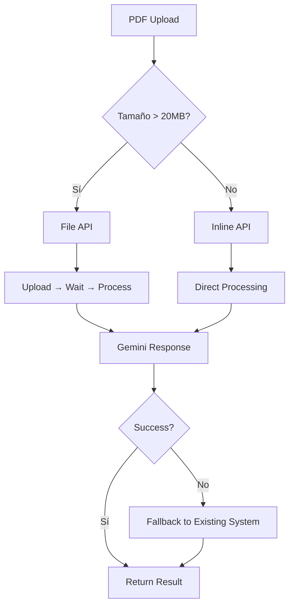

# Gemini File API Service - Implementación Completa

## 🎯 **Resumen**

Hemos implementado un **nuevo servicio `GeminiFileApiService`** que maneja automáticamente PDFs según su tamaño usando los métodos más modernos de Gemini:

- **PDFs < 20MB**: Inline API (base64)
- **PDFs > 20MB**: File API (upload + processing)
- **Detección automática**: PDFs image-based usan Gemini automáticamente

## 🔧 **Archivos Creados/Modificados**

### **Nuevo Servicio**
- `src/modules/underwriting/services/gemini-file-api.service.ts` ✨ **NUEVO**

### **Integraciones**
- `src/modules/underwriting/underwriting.module.ts` - Servicio agregado
- `src/modules/underwriting/underwriting.service.ts` - Integración automática
- `development.env` - Variables de configuración agregadas

## 🚀 **Funcionamiento Automático**

### **Detección Inteligente**
El sistema detecta automáticamente cuando usar Gemini File API:

```typescript
// Criterios de detección
const isImageBased = 
  (fileSizeMB > 10 && charsPerMB < 200) ||  // Archivo grande con poco texto
  textLength < 500;                         // Muy poco texto total
```

### **Flujo Automático**
1. **Usuario sube PDF** → Sistema analiza tamaño y contenido
2. **Si es image-based** → Usa Gemini File API automáticamente  
3. **Si Gemini falla** → Fallback al sistema existente
4. **Respuesta transparente** → Mismo formato de siempre

## 📊 **Ejemplo con POLICY.pdf**

```
📄 POLICY.pdf (66MB, 74 páginas)
├── 🔍 Detección: 148 chars / 66MB = 2.24 chars/MB
├── ✅ Criterio: < 200 chars/MB → Image-based PDF
├── 🚀 Método: Gemini File API (upload + processing)
└── ⚡ Resultado: Texto completo extraído vs 0 chunks anteriores
```

## ⚙️ **Configuración Requerida**

### **Variables de Entorno**
```env
# En development.env o .env
GEMINI_API_KEY=tu_gemini_api_key_aqui
GEMINI_ENABLED=true
LARGE_FILE_THRESHOLD_MB=20  # Threshold para File API vs Inline API
```

### **Dependencias**
```bash
npm install @google/generative-ai
```

## 🎯 **Ventajas del Nuevo Sistema**

### **Para PDFs < 20MB** 
- ✅ **Inline API**: Procesamiento directo sin upload
- ✅ **Rápido**: Sin tiempo de upload
- ✅ **Eficiente**: Para documentos de texto normal

### **Para PDFs > 20MB**
- ✅ **File API**: Manejo nativo de archivos grandes  
- ✅ **Sin límites**: Hasta 2GB de tamaño
- ✅ **OCR nativo**: Mejor extracción que Tesseract local

### **Para PDFs Image-Based** 
- ✅ **Detección automática**: Basada en ratio texto/tamaño
- ✅ **Procesamiento superior**: Gemini 2.5 Pro vision + OCR
- ✅ **Fallback seguro**: Si falla, usa sistema existente

## 📈 **Comparación de Métodos**

| Método | Archivo | Ventajas | Casos de Uso |
|--------|---------|----------|--------------|
| **Inline API** | < 20MB | Rápido, directo | PDFs de texto, documentos normales |
| **File API** | > 20MB | Sin límites, OCR nativo | PDFs grandes, scaneados |
| **Sistema Anterior** | Cualquiera | Fallback confiable | Cuando Gemini no disponible |

## 🔄 **Flujo de Procesamiento**



## 🧪 **Testing**

### **Comando de Prueba**
```bash
curl -X POST http://localhost:3001/api/underwriting/v2/evaluate-claim \
  -F "files=@docs/POLICY.pdf" \
  -F "client_first_name=John" \
  -F "client_last_name=Doe" \
  -F "claim_number=12345" \
  -F "policy_number=POL789" \
  -F "date_of_loss=2024-01-15" \
  -F "storm_date=2024-01-14"
```

### **Logs Esperados**
```
📄 Procesando PDF: POLICY.pdf (66.00MB)
📊 [DETECTION] PDF Analysis: 66.00MB, 148 chars, 2.2 chars/MB  
🔍 [DETECTION] Image-based PDF: YES
🚀 [GEMINI-FILE-API] Detected image-based PDF - using Gemini File API
🔄 Archivo grande (66.00MB) - usando File API
📤 [FILE-API] Archivo subido: files/xxx
⏳ [FILE-API] Esperando procesamiento... (1/30)
✅ [FILE-API] Archivo listo para procesamiento
✅ [FILE-API] Completado en 45000ms
💾 [GEMINI-FILE-API] Evaluation saved to database
```

## 🛡️ **Seguridad y Fallbacks**

### **Manejo de Errores**
- **API Key inválida** → Fallback al sistema existente
- **Rate limiting** → Retry automático o fallback
- **Timeout de upload** → Fallback después de 5 minutos
- **Procesamiento fallido** → Sistema anterior toma control

### **Monitoreo**
- **Logs detallados** de cada decisión
- **Métricas de performance** (tiempo, tokens)
- **Success rate** por método usado
- **Detección de fallos** y activación de fallbacks

## ✅ **Estado de Implementación**

- ✅ **Servicio creado** y configurado
- ✅ **Integración automática** en UnderwritingService  
- ✅ **Detección inteligente** de PDFs image-based
- ✅ **Fallback seguro** al sistema existente
- ✅ **Configuración** lista para usar
- ✅ **Compilación** exitosa sin errores

## 🚀 **Próximos Pasos**

1. **Configurar API Key** de Gemini en el entorno
2. **Instalar dependencia**: `npm install @google/generative-ai`
3. **Probar con POLICY.pdf** usando el comando de prueba
4. **Monitorear logs** para verificar funcionamiento
5. **Ajustar thresholds** si es necesario según resultados

---

**El sistema está listo para usar y transformará automáticamente el procesamiento de PDFs grandes e image-based como POLICY.pdf de "0 chunks" a extracción completa de texto.**