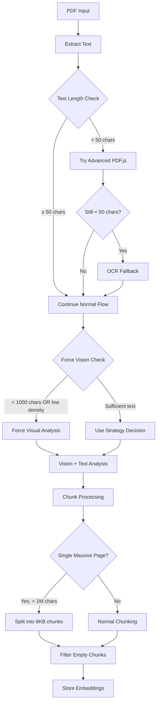

# 🚀 Mejoras Implementadas - Sistema de Evaluación PDF

## Resumen de Cambios (Septiembre 2025)

### ✅ Completado: Plan Crítico de Estabilización RAG PDF

---

## 1. 🔍 **Lógica de Visión Forzada**
**Archivo:** `src/modules/underwriting/underwriting.service.ts`
**Problema:** PDFs con poca extracción de texto (como POLICY.pdf) no activaban análisis visual.
**Solución:** Implementada lógica que fuerza modo visión cuando:
- Texto total < 1000 caracteres
- Texto por página < 200 caracteres/página  
- Densidad de texto < 50,000 caracteres/MB

```typescript
// Force vision if text extraction is insufficient
const shouldForceVision = textLength < 1000 || 
                         textPerPage < 200 || 
                         textPerMB < 50000;
```

---

## 2. 📄 **Splitting de Documentos Masivos (POLICY.pdf)**
**Archivo:** `src/modules/underwriting/chunking/services/enhanced-pdf-processor.service.ts`
**Problema:** Documentos de una página con >1M caracteres saturaban el sistema de embeddings.
**Solución:** Splitting automático en chunks de 8KB para documentos masivos.

```typescript
// Split massive single pages into 8KB chunks
if (textPages.length === 1 && textPages[0].content.length > 1_000_000) {
  const chunkSize8KB = 8192;
  // Split content into manageable chunks
}
```

---

## 3. 🗑️ **Validación de Chunks Vacíos**
**Archivos:** 
- `src/modules/underwriting/services/semantic-chunking.service.ts`
- `src/modules/underwriting/services/vector-storage.service.ts`

**Problema:** Chunks vacíos o con ≤10 caracteres causaban errores en embeddings.
**Solución:** Filtrado automático con logging de chunks omitidos.

```typescript
// Skip empty/tiny chunks
const trimmedContent = chunk.content?.trim() || '';
if (trimmedContent.length <= 10) {
  skippedEmpty++;
  this.logger.warn(`⚠️ Skipping empty/tiny chunk: only ${trimmedContent.length} chars`);
  continue;
}
```

---

## 4. 🔍 **OCR Fallback Avanzado**
**Archivo:** `src/modules/underwriting/services/pdf-toolkit.service.ts`
**Problema:** PDFs escaneados (ROOF.pdf, WEATHER.pdf) sin capa de texto.
**Solución:** Fallback escalonado con configuración por ambiente.

**Flujo de Extracción:**
1. **pdf-parse** (rápido)
2. **pdfjs-dist** (avanzado)  
3. **Tesseract.js OCR** (limitado por páginas)

```typescript
// OCR fallback for insufficient text
if (textLength < 50) {
  const maxOcrPages = parseInt(process.env.MAX_OCR_PAGES || '3');
  // Convert to images and extract text via OCR
}
```

---

## 5. ⚙️ **Variables de Entorno Agregadas**

```bash
# OCR Configuration
OCR_ENABLED=true              # Enable/disable OCR fallback
MAX_OCR_PAGES=3              # Limit OCR to first N pages

# Vision Forcing Thresholds  
FORCE_VISION_THRESHOLD=1000   # Minimum text length before forcing vision
TEXT_PER_PAGE_THRESHOLD=200   # Minimum text per page
TEXT_DENSITY_THRESHOLD=50000  # Minimum text density per MB
```

---

## 📊 **Métricas de Impacto Esperadas**

### 🎯 **Casos de Uso Mejorados:**
- **POLICY.pdf**: Análisis visual automático + chunks manejables
- **ROOF.pdf/WEATHER.pdf**: OCR fallback para documentos escaneados  
- **Documentos híbridos**: Mejor detección de contenido insuficiente

### ⚡ **Performance:**
- Reducción de errores de embedding por chunks vacíos
- Límites configurables para OCR (máx 3 páginas por defecto)
- Splitting automático evita timeouts en documentos masivos

### 🛡️ **Robustez:**
- Fallback graceful en todos los niveles de extracción
- Logging detallado para troubleshooting
- Configuración flexible por ambiente

---

## 🔄 **Flujo de Procesamiento Actualizado**



---

## 🚀 **Próximos Pasos Recomendados**

1. **Testing en Producción:** Probar con archivos problemáticos reales
2. **Monitoreo:** Verificar logs de visión forzada y chunks omitidos
3. **Optimización OCR:** Ajustar `MAX_OCR_PAGES` según performance
4. **Métricas:** Implementar tracking de éxito por tipo de documento

---

## 📋 **Checklist de Verificación**

- [x] Lógica de visión forzada implementada
- [x] Splitting de documentos masivos 
- [x] Validación de chunks vacíos
- [x] OCR fallback con límites configurables
- [x] Variables de entorno documentadas
- [x] Logging mejorado para troubleshooting
- [x] Compilación exitosa
- [ ] Testing en entorno real
- [ ] Validación de performance en producción

---

**Fecha de Implementación:** Septiembre 17, 2025  
**Estado:** ✅ Listo para despliegue y pruebas