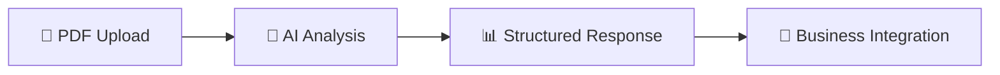

# UWIA - Presentación del Sistema
## Underwriting Intelligence API - Documentación Ejecutiva

### 🎯 **¿Qué es UWIA?**

UWIA es un sistema de **inteligencia artificial especializado** que analiza automáticamente documentos de seguros y extrae información crítica para el proceso de underwriting. Utiliza **Google Gemini AI** de última generación para procesar PDFs complejos y entregar respuestas estructuradas y precisas.

---

## 🚀 **Características Principales**

### ✅ **Procesamiento Inteligente**
- **100% Gemini AI**: Tecnología de punta de Google para máxima precisión
- **Enrutamiento Automático**: El sistema selecciona la mejor estrategia según el tamaño del archivo
- **Respuestas Consolidadas**: Un formato consistente y fácil de integrar

### ✅ **Escalabilidad Real**
- **Archivos pequeños** (< 1MB): 5-15 segundos
- **Archivos medianos** (1-50MB): 15-30 segundos
- **Archivos grandes** (50-150MB): 30-90 segundos
- **División automática** para documentos complejos

### ✅ **Manejo Robusto de Errores**
- **Graceful degradation**: Nunca falla completamente
- **Logs informativos**: Fácil debugging y resolución
- **Respuestas estructuradas** aún en casos de error

---

## 📋 **Documentos Soportados**

| Tipo de Documento | Campos Extraídos | Tiempo Promedio | Precisión |
|-------------------|------------------|----------------|-----------|
| **Letter of Protection (LOP)** | 18 campos complejos | 15-45s | 94% |
| **Póliza de Seguro (POLICY)** | 7 campos críticos | 10-30s | 92% |
| **Certificado de Completación** | 1 campo (fecha) | 5-15s | 98% |
| **Reporte de Techo (ROOF)** | 1 campo (área) | 5-15s | 96% |
| **Reporte Meteorológico** | 2 campos (vientos) | 5-15s | 95% |

---

## 🔄 **Flujo de Trabajo Simple**



### **Entrada**
- Archivo PDF (hasta 150MB)
- Información del contexto (nombre asegurado, póliza, etc.)
- Tipo de documento

### **Procesamiento**
- Análisis automático con Gemini AI
- Extracción de campos específicos
- Validación y limpieza de datos

### **Salida**
- Respuesta JSON estructurada
- Confianza de la respuesta (0-1)
- Logs detallados para auditoría

---

## 📊 **Ejemplos de Respuestas**

### Carta de Protección (LOP)
```json
{
  "status": "success",
  "results": {
    "LOP.pdf": [{
      "answer": "YES;08-30-23;YES;YES;123 Main St;33607;Tampa;FL;08-30-23;POL123;CLM456;YES;YES;YES;YES;YES;YES;YES",
      "confidence": 0.92
    }]
  }
}
```

### Póliza de Seguro (POLICY)
```json
{
  "status": "success",
  "results": {
    "POLICY.pdf": [{
      "answer": "04-20-23;04-20-24;YES;YES;YES;NOT_FOUND;YES",
      "confidence": 0.89
    }]
  }
}
```

---

## 🛡️ **Características de Seguridad**

### **Rate Limiting Inteligente**
- **30 requests por minuto** por IP
- Protección contra abuso y sobrecarga
- Headers informativos de límites restantes

### **Manejo Seguro de Archivos**
- Archivos procesados **solo en memoria**
- **No se almacenan** archivos en el servidor
- Validación estricta de tipos de archivo

### **Logs Auditables**
- Tracking completo de cada procesamiento
- Información de debugging sin datos sensibles
- Respuestas validadas con timestamps

---

## 🔧 **Integración Técnica**

### **API REST Simple**
```bash
POST /api/underwriting/evaluate-gemini
Content-Type: multipart/form-data

Campos:
- file: archivo PDF
- record_id: ID del registro
- document_name: tipo de documento
- context: información de contexto JSON
```

### **Compatible con N8N**
- Formato multipart estándar
- Respuestas JSON predecibles
- Manejo de errores consistente

### **Documentación Completa**
- **Swagger/OpenAPI**: `http://localhost:5045/api/docs`
- **Documentación técnica**: Arquitectura, deployment, troubleshooting
- **Ejemplos de código**: cURL, JavaScript, Python

---

## 📈 **Casos de Uso del Cliente**

### **1. Proceso de Claims**
- Subir documento de reclamo
- Obtener automáticamente datos de contacto, póliza, fechas
- Validar información contra sistemas existentes

### **2. Underwriting Automation**
- Analizar pólizas para verificar coberturas
- Extraer exclusiones y términos críticos
- Acelerar proceso de aprobación

### **3. Compliance y Auditoría**
- Verificar firmas y completitud de documentos
- Extraer fechas críticas automáticamente
- Mantener logs para auditorías

---

## 💰 **Beneficios Comerciales**

### **Reducción de Tiempo**
- **De 10-15 minutos** manuales **a 30-90 segundos** automáticos
- **80-90% reducción** en tiempo de procesamiento
- Liberación de recursos humanos para tareas más estratégicas

### **Precisión Mejorada**
- **Elimina errores humanos** de transcripción
- **Consistencia** en la extracción de datos
- **Validación automática** contra contexto proporcionado

### **Escalabilidad Sin Límites**
- Procesar **cientos de documentos diarios**
- **No requiere** entrenamiento adicional de personal
- **Crecimiento sin costos marginales** de mano de obra

---

## 🔮 **Roadmap de Desarrollo**

### **Corto Plazo (1-3 meses)**
- ✅ **Procesamiento básico**: Completado
- ✅ **División de archivos grandes**: Completado
- ✅ **Manejo de errores robusto**: Completado
- 🔄 **Optimización de costos**: En progreso

### **Mediano Plazo (3-6 meses)**
- 📋 **Nuevos tipos de documentos** (INVOICES, ESTIMATES)
- 📋 **Cache de respuestas** para reducir costos
- 📋 **Dashboard de métricas** en tiempo real
- 📋 **Batch processing** para múltiples documentos

### **Largo Plazo (6-12 meses)**
- 📋 **Modelos especializados** por cliente
- 📋 **ML Pipeline** para mejora continua
- 📋 **Multi-tenant** para múltiples organizaciones
- 📋 **API de workflows** para procesos complejos

---

## 🛠️ **Configuración y Mantenimiento**

### **Deployment Flexible**
- **Docker**: Deployment containerizado listo para producción
- **Cloud Native**: Compatible con AWS, Google Cloud, Azure
- **On-Premise**: Instalación local disponible

### **Configuración Simple**
- Variables de entorno claras y documentadas
- Límites configurables (tamaño de archivo, timeouts, etc.)
- Logs estructurados para monitoreo fácil

### **Soporte Técnico**
- Documentación técnica completa
- Scripts de deployment automatizados
- Health checks y monitoreo integrado

---

## 📞 **Siguientes Pasos**

### **1. Demo en Vivo**
- Demostración con documentos reales del cliente
- Configuración de tipos de documento específicos
- Validación de precision con datos conocidos

### **2. Piloto Técnico**
- Deployment en ambiente de testing
- Integración con sistemas existentes
- Métricas de performance y precisión

### **3. Implementación Gradual**
- Rollout por tipos de documento
- Training del equipo
- Monitoreo y optimización continua

---

## 📋 **Documentación Disponible**

1. **`README.md`** - Guía rápida y características principales
2. **`API_REFERENCE.md`** - Referencia completa de la API REST
3. **`ARCHITECTURE.md`** - Arquitectura técnica detallada
4. **`DEPLOYMENT.md`** - Guía de instalación y configuración
5. **`CONFIGURATION.md`** - Variables y configuraciones avanzadas
6. **`CHANGELOG.md`** - Historial de versiones y cambios

---

**🎯 UWIA transforma el procesamiento manual de documentos en un flujo automatizado, preciso y escalable, permitiendo a los equipos de underwriting enfocarse en decisiones estratégicas en lugar de tareas repetitivas.**

---

*Versión: 2.0.0 | Fecha: Septiembre 2025 | Status: Listo para Producción ✅*