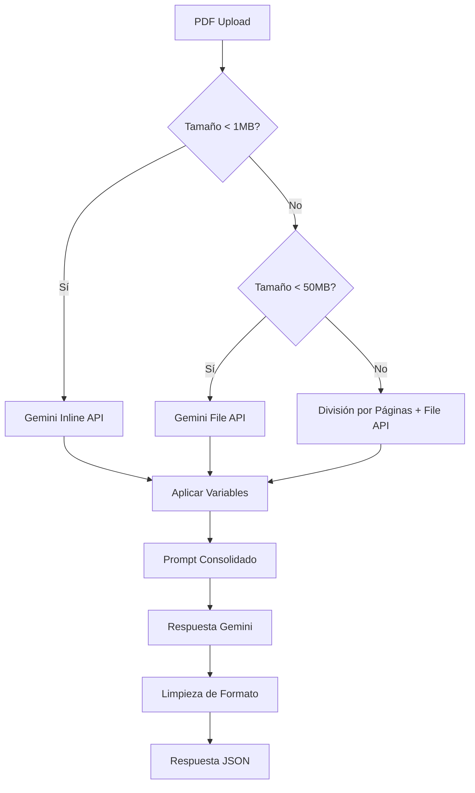

# Configuración del Sistema UWIA

## Variables de Entorno

### Google Gemini API (Principal)
- **GOOGLE_GEMINI_API_KEY**: Clave API de Google Gemini (obligatorio)
- **GOOGLE_GEMINI_MODEL**: Modelo Gemini a usar (gemini-1.5-pro recomendado)
- **GEMINI_MAX_TOKENS**: Límite máximo de tokens por request (1048576)
- **GEMINI_TEMPERATURE**: Temperatura para respuestas (0.1 para consistencia)

### Enrutamiento de Archivos
- **GEMINI_INLINE_MAX_SIZE**: Tamaño máximo para Inline API en bytes (1048576 = 1MB)
- **GEMINI_FILE_MAX_SIZE**: Tamaño máximo para File API en bytes (52428800 = 50MB)
- **GEMINI_SPLIT_THRESHOLD**: Umbral para división de páginas en bytes (52428800 = 50MB)

### Rate Limiting
- **THROTTLE_TTL**: Tiempo en segundos para el límite (60)
- **THROTTLE_LIMIT**: Número máximo de solicitudes por TTL (30)
- **GEMINI_RATE_LIMIT_RPM**: Solicitudes por minuto a Gemini (60)
- **GEMINI_MAX_RETRIES**: Reintentos en caso de error (3)
- **GEMINI_RETRY_DELAY**: Demora entre reintentos en ms (2000)

### Procesamiento de Archivos
- **MAX_FILE_SIZE**: Tamaño máximo de archivo en bytes (157286400 = 150MB recomendado)
- **ENABLE_PDF_SPLITTING**: Habilitar división automática de PDFs grandes (true)
- **MAX_PAGES_PER_CHUNK**: Páginas máximas por fragmento al dividir (50)

### Manejo de Archivos Grandes
- **GRACEFUL_SKIP_OVERSIZED**: Continuar sin archivo si excede límite (true)
- **LOG_FILE_SKIP_DETAILS**: Logging detallado para archivos saltados (true)

## Características de Seguridad

1. **Rate Limiting**: Protege contra abuso limitando solicitudes por minuto
2. **Validación de Tamaño**: Manejo automático de archivos hasta 64MB
3. **Enrutamiento Inteligente**: Selección automática de API según tamaño
4. **División Segura**: PDFs grandes se dividen por páginas, no por bytes
5. **Límites de Token**: Control estricto de tokens Gemini (1M límite)
6. **Validación de Entrada**: Verificación de formato y contenido de archivos

## Optimizaciones de Rendimiento

1. **Cache de Consultas**: Las consultas a BD se cachean automáticamente
2. **Enrutamiento Optimizado**:
   - `< 1MB` → Gemini Inline (más rápido)
   - `1-50MB` → Gemini File API (balanceado)
   - `> 50MB` → División por páginas (escalable)
3. **Procesamiento Puro Gemini**: Sin fallbacks ni procesamiento local
4. **Respuestas Consolidadas**: Una respuesta por documento reduce overhead
5. **Logging Optimizado**: Logs estructurados para debug eficiente

## Flujo de Procesamiento

### Endpoint: `/api/underwriting/evaluate-gemini`



## Variables de Contexto

El sistema espera las siguientes variables en el contexto JSON:

```json
{
  "insured_name": "Nombre del asegurado",
  "insurance_company": "Compañía de seguros",
  "insured_address": "Dirección completa",
  "insured_street": "Dirección de calle",
  "insured_city": "Ciudad",
  "insured_zip": "Código postal",
  "date_of_loss": "Fecha de pérdida (MM-DD-YY)",
  "policy_number": "Número de póliza",
  "claim_number": "Número de reclamo",
  "type_of_job": "Tipo de trabajo",
  "cause_of_loss": "Causa de pérdida"
}
```

## Configuración de Base de Datos

### Tabla: `document_consolidado`

Almacena los prompts consolidados para cada tipo de documento:

```sql
CREATE TABLE document_consolidado (
  id INT AUTO_INCREMENT PRIMARY KEY,
  document_name VARCHAR(100) NOT NULL,
  pmc_field VARCHAR(100) NOT NULL,
  question_prompt TEXT NOT NULL,
  field_names TEXT,
  active BOOLEAN DEFAULT TRUE,
  created_at TIMESTAMP DEFAULT CURRENT_TIMESTAMP
);
```

### Documentos Configurados

- **LOP.pdf**: 18 campos de validación de carta de protección
- **POLICY.pdf**: 7 campos de análisis de póliza
- **CERTIFICATE.pdf**: 1 campo de fecha de completación
- **ROOF.pdf**: 1 campo de área total del techo
- **WEATHER.pdf**: 2 campos de datos meteorológicos